<!-- Hand-made SVGs live in assets/ and are generated by scripts/build-assets.mjs.
     The snake and 3D contribution graph are rebuilt every 12 hours by
     .github/workflows/profile-art.yml and published to the `output` branch. -->

 

  

  

<h2 id="about">🧑‍🚀 About Me</h2>

- 🎓 Final-year **B.Tech IT** student at **IIIT Allahabad**
- 💼 Ex-**SDE Intern** at Aplus Technology Solutions: shipped **2 production web apps** end-to-end (Next.js + FastAPI), both live on Vercel
- 🛰️ Building **[OffGrid](https://github.com/Stark2028/offgrid-emergency-nav)**: navigation that keeps routing when the internet is gone. On-device A\*, no backend
- 🔬 Research fellow on a **security audit framework for IoT networks**, sponsored by C3iHub, IIT Kanpur
- ⚔️ Competitive programmer: CodeChef peak **1771**, **Global Rank 17** in Starters 235
- 🧪 I treat tests as part of the product: **4,100+** on one codebase, **367** on another
- 🏸 Off-screen: **gold** at the All India Inter-IIIT badminton tournament

  
    
  

<h2 id="projects">🚀 Featured Projects</h2>

  
  
  
  

  
  
  

<h2 id="stack">🧰 Tech Stack</h2>

<table align="center">
  <tr>
    <td align="center" width="150"><b>Languages</b></td>
    <td></td>
  </tr>
  <tr>
    <td align="center"><b>Frontend</b></td>
    <td></td>
  </tr>
  <tr>
    <td align="center"><b>Backend</b></td>
    <td></td>
  </tr>
  <tr>
    <td align="center"><b>Cloud &amp; Data</b></td>
    <td></td>
  </tr>
  <tr>
    <td align="center"><b>Tools</b></td>
    <td></td>
  </tr>
  <tr>
    <td align="center"><b>Also shipped with</b></td>
    <td>
      
      
      
      
      
      
      
      
      
      
      
      
      
    </td>
  </tr>
</table>

<h2 id="stats">📊 GitHub Stats</h2>

  
  
    
  <picture>
    <source media="(prefers-color-scheme: dark)" srcset="https://raw.githubusercontent.com/Stark2028/Stark2028/output/profile-3d-dark.svg"/>
    <source media="(prefers-color-scheme: light)" srcset="https://raw.githubusercontent.com/Stark2028/Stark2028/output/profile-3d-light.svg"/>
    
  </picture>

<h2 id="cp">⚔️ Competitive Programming</h2>

<table align="center">
  <tr>
    <td align="center" width="55%">
      
    </td>
    <td align="center" width="45%">
      
        
      
        
      
        
      
    </td>
  </tr>
</table>

<h2 id="achievements">🏆 Achievements</h2>

<table>
  <tr>
    <td align="center" width="33%"><h3>🥇</h3><b>Gold medal</b> All India Inter-IIIT Men's Badminton</td>
    <td align="center" width="33%"><h3>🏆</h3><b>Global Rank 17</b> CodeChef Starters 235 · peak rating 1771</td>
    <td align="center" width="33%"><h3>📈</h3><b>Top 5%</b> 663 of 14,000+ · Goldman Sachs India Hackathon 2026</td>
  </tr>
  <tr>
    <td align="center"><h3>🔬</h3><b>Funded research fellowship</b> Security audit framework for IoT networks · C3iHub, IIT Kanpur</td>
    <td align="center"><h3>🧠</h3><b>NTSE Stage 1</b> 1M+ applicants · 0.5% qualify</td>
    <td align="center"><h3>🎯</h3><b>300+ DSA problems</b> LeetCode · GeeksforGeeks · CodeChef</td>
  </tr>
</table>

<h2 id="fun">🎉 Fun Zone</h2>

  
    
  

<h2 id="connect">📬 Connect</h2>

  
  
  
  
  

 

<picture>
  <source media="(prefers-color-scheme: dark)" srcset="https://raw.githubusercontent.com/Stark2028/Stark2028/output/snake-dark.svg"/>
  <source media="(prefers-color-scheme: light)" srcset="https://raw.githubusercontent.com/Stark2028/Stark2028/output/snake.svg"/>
  
</picture>

